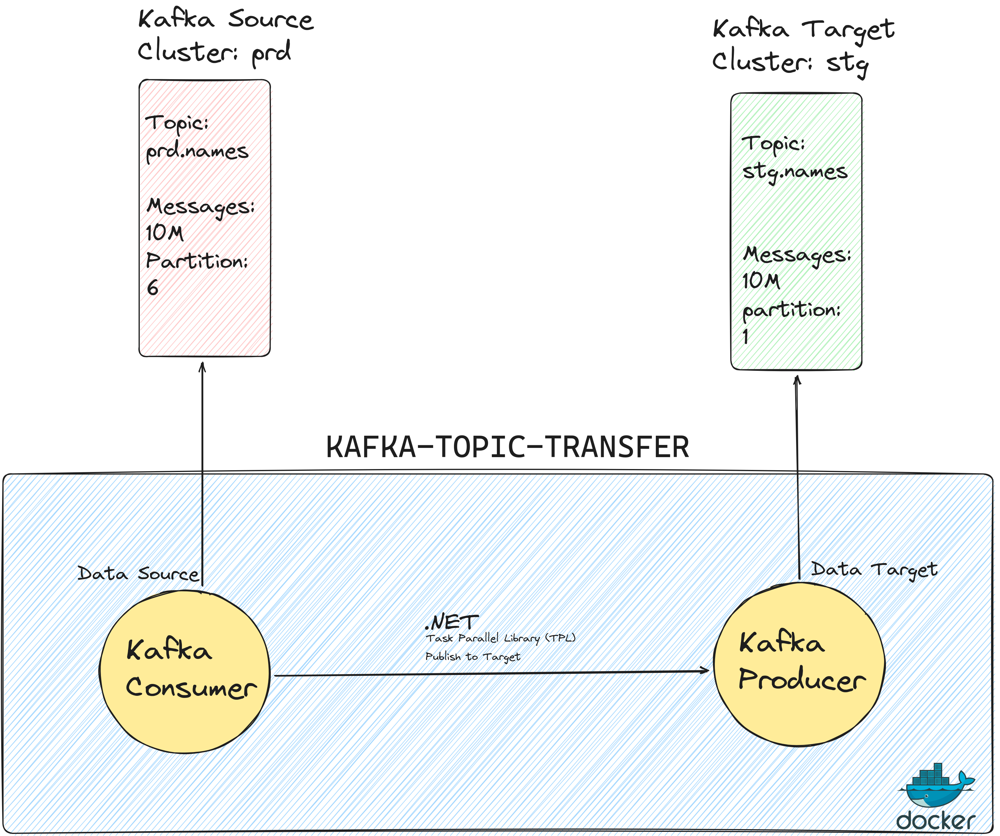

# Kafka Topic Transfer

*This tool simplifies the process of copying messages from one Kafka topic to another (cross environment & cluster).*



## Prerequisite
  - DotNet SDK 8.0
  - Docker
  - IDE: VSCode, Visual Studio or Rider

## Configuration

The configuration file, `appsettings.json`, must be provided through a `volume mapping` when running the Docker container.

```json
{
  //TARGET KAKFKA
  "KafkaTargetOptions": {
    "BootstrapServers": "",
    "SaslUsername": "",
    "SaslPassword": "",
    "Topic": "",
    "UseSinglePartition": true,
    "EnableIdempotence": true
  },
  //SOURCE KAFKA
  "KafkaConsumerSourceOptions": {
    "BootstrapServers": "",
    "SaslUsername": "",
    "SaslPassword": "",
    "Topic": "",
    "GroupId": "",
    "GroupInstanceId": "",
    "AutoOffsetReset": 1,
    "EnableAutoCommit": true,
    "AutoCommitIntervalMs": 5000,
    "EnableAutoOffsetStore": false,
    "PauseTriggerMessageCount": 10,
    "PauseTriggerInterval": 100
  },
  "Serilog": {
    "MinimumLevel": {
      "Default": "Information"
    },
    "WriteTo": [
      {
        "Name": "Console",
        "Args": {
          "formatter": "Serilog.Formatting.Compact.RenderedCompactJsonFormatter, Serilog.Formatting.Compact"
        }
      }
    ],
    "Properties": {
      "Application": "kafka-topic-transfer",
      "ContainerId": "local-machine"
    }
  }
}
```


## Running with Docker

Execute the `30_run-container.sh` script or use the standard Docker run command. The script includes the `--rm` flag to automatically remove the container upon completion.

```sh

# Linux/ MacOs
$ ./30_run-container.sh ./src/kafka.transfer.app/appsettings.linux.json

# Windows
$ ./30_run-container.sh "C:\APPSETTINGS_PATH\appsettings.MACHINENAME.json"


# OR
$ docker run -it --rm -v "ABSOLUTE_APPSETTINGS_PATH:/app/appsettings.json" ghcr.io/informatievlaanderen/kafka-topic-transfer:0.0.4
```

## Running with Docker-Compose


Utilize the existing `docker-compose.yml` file for a seamless experience.

```sh
version: '3.9'

networks:
  basisregisters:

services:
  basisregisters.kafka-topic-transfer:
    image: ghcr.io/informatievlaanderen/kafka-topic-transfer:0.0.4
    container_name: basisregisters.kafka-topic-transfer
    volumes:
      - "/home/yusuf/repos/fork/kafka-transfer/src/kafka.transfer.app/appsettings.linux.json:/app/appsettings.json"
    restart: always
    networks:
      - basisregisters
    tty: true
    stdin_open: true
```

Ensure the container is automatically removed upon completion.

```sh 
$ docker-compose run --rm basisregisters.kafka-topic-transfer
```

## Disclaimer

**The application remains active until the user manually initiates termination.**

*This behavior also applies to the Docker container.*

Due to performance considerations, numerous `Tasks` are executed without an `await`. Consequently, the lifetime of task completion is decoupled and not actively tracked. While assurance exists that all tasks will eventually conclude, the application lacks awareness of this. Therefore, manual key input from the user is required for termination.


## New Release

Building and deploying a new release goes as followed.

```sh

# dotnet release build && containerize
$ ./00_build-container.sh

# pushes to github registry
$ ./10_push-to-registry.sh

```

## Shell into container

If you need to access the container's `shell` instead of executing the application run this command

```sh
# --entrypoint /bin/bash
$ ./20_shell-container.sh
```